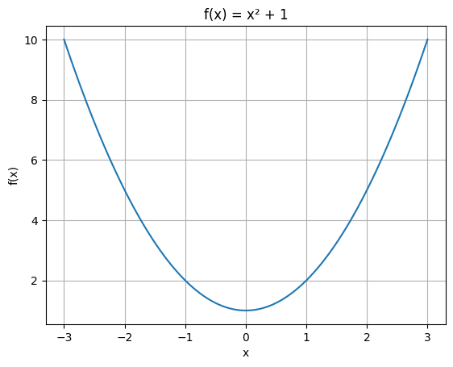
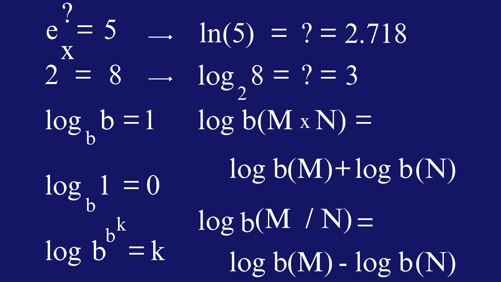

# 📐 Modül 1: Fonksiyonlar ve Limitler

Bu modülde matematiksel fonksiyonların temellerini, tanım ve değer kümelerini, parçalı fonksiyonları ve temel matematiksel işlemleri öğreneceksiniz.

---

## 🔢 Fonksiyon Nedir?

Fonksiyon (f), bir girdiyi (x) alır ve bir çıkış (y) üretir.

- Her x için **yalnızca bir y değeri** vardır → bu bir fonksiyondur.
- Aynı y değerini farklı x'lerde almak sorun değildir.  
   Ancak **aynı x için birden çok y varsa** → **Fonksiyon değildir.**
  Örneğin aşağıdaki eğri bir **fonksiyon değildir:**
  yon Nedir?

Fonksiyon (f), bir girdiyi (x) alır ve bir çıkış (y) üretir.

- Her x için **yalnızca bir y değeri** vardır → bu bir fonksiyondur.
- Aynı y değerini farklı x’lerde almak sorun değildir.  
   Ancak **aynı x için birden çok y varsa** → **Fonksiyon değildir.**
  Örneğin aşağıdaki eğri bir **fonksiyon değildir:**
  

Bir fonksiyonun temel tanımı:

Girdi alır → İşlem yapar → Tek bir çıktı üretir.

Örneğin:  
 f(x) = x² + 1

Bu fonksiyon bir paraboldür.

- f(0) = 0² + 1 = 1
- f(1) = 1² + 1 = 2
- f(-1) = (-1)² + 1 = 2
- f(2) = 2² + 1 = 5

## Tanım Kümesi (Domain) ve Değer Kümesi (Range)

### Domain (Tanım Kümesi):

Fonksiyonda x yerine yazılmasına izin verilen tüm değerler tanım kümesini oluşturur.

### Range (Değer Kümesi):

Fonksiyon kutusundan çıkabilecek tüm olası sonuçlar değer kümesini oluşturur.

### f(x) = 1 / x fonksiyonunun tanım ve değer kümesini inceleyelim.

| Özellik                   | Açıklama                                                                    |
| ------------------------- | --------------------------------------------------------------------------- |
| **Tanım Kümesi (Domain)** | x = 0 yazılamaz çünkü payda sıfır olur ve tanımsızdır.  **x ∈ ℝ, x ≠ 0** |
| **Değer Kümesi (Range)**  | 1 hiçbir reel sayıya bölündüğünde sonuç 0 olamaz.  **y ∈ ℝ, y ≠ 0**      |

### g(x) = √(x + 1) Fonksiyonunun Tanım ve Değer Kümesi

| Özellik                   | Açıklama                                                                     |
| ------------------------- | ---------------------------------------------------------------------------- |
| **Tanım Kümesi (Domain)** | Karekök içinde negatif sayı gerçek sayı değildir.  **x + 1 ≥ 0 → x ≥ -1** |
| **Değer Kümesi (Range)**  | Karekök fonksiyonunun sonucu negatif olamaz.  **y ≥ 0**                   |

## Parçalı Fonksiyonlar (Piecewise Functions)

Bazen bir fonksiyon, farklı x değerleri için **farklı kurallara göre tanımlanır**. Bu tür fonksiyonlara **parçalı (piecewise) fonksiyonlar** denir.

f(x) = {

        x² + 1    if x > 0  ,

        x - 1     if x <= 0

}

Bu fonksiyonun grafiğini çizersek:

x² + 1 kısmı yalnızca x > 0 için geçerlidir. Bu yüzden 0 noktasında açık daire ile başlar.

x − 1 kısmı x ≤ 0 için geçerlidir. Bu yüzden 0 noktasında kapalı daire ile başlar.

Bu fonksiyon **süreksizdir** çünkü iki parça x = 0 noktasında birleşmez.

## Bir Matematiksel İfadeye Neler Yapabiliriz?

| İşlem                                 | Amaç                                     | Örnek                     |
| ------------------------------------- | ---------------------------------------- | ------------------------- |
| **1 ile çarpmak**                     | Biçimi değiştirmek ama değeri korumak    | 1/2 \* 3/3                |
| **0 eklemek**                         | Değeri değiştirmeden denklemi düzenlemek | x - 2 + 2 = 6 + 2 → x = 8 |
| **Aynı şeyi iki tarafa da uygulamak** | Eşitliği koruyarak çözüm yapmak          | 3x = 6 ise x = 6 / 3 = 2  |

## İki Terimli İfadeleri (Binomları) Çarpma

(x+2)(x+2)=

- x \* x = x^2
- x \* 2 = 2x
- 2 \* x = 2x
- 2 \* 2 = 4

Toplayalım:

x^2 + 2x + 2x + 4 = x^2 + 4x + 4

## Üç Terimli ile Binom Çarpımı

(x + y)^3 =

(x + y)^3 = (x + y)(x + y)(x + y)

(x^2 + 2xy + y^2)(x + y)

- x^2 \* x = x^3
- x^2 \* y = x^2y
- 2xy \* x = 2x^2y
- 2xy \* y = 2xy^2
- y^2 \* x = xy^2
- y^2 \* y = y^3

Hepsini toplayalım:

x^3 + x^2y + 2x^2y + 2xy^2 + xy^2 + y^3

Benzer terimleri gruplayalım:

x^3 + 3x^2y + 3xy^2 + y^3

## Pascal Üçgeni ile Hızlı Açılım

- ilk terimi ikinci parantezdeki her şeyle çarp
- sonra diğer terimi çarp
  Buna **FOIL** denir: First, Outer, Inner, Last (İlk, Dış, İç, Son).
- Çıkan sonuçları topla:

| Üs (n) | Açılım Katsayıları |
| ------ | ------------------ |
| 0      | 1                  |
| 1      | 1 1                |
| 2      | 1 2 1              |
| 3      | 1 3 3 1            |
| 4      | 1 4 6 4 1          |

örnek: (x + y)^4 = x^4 + 4x^3*y + 6x^2*y^2 + 4x\*y^3 + y^4

## Paydayı Rasyonelleştirme

### Paydada Kökten Kurtulma

| Aşama           | Açıklama                                                             |
| --------------- | -------------------------------------------------------------------- |
| 1. Amaç         | Paydadaki karekökten kurtulmak (irrasyonel ifadeyi rasyonelleştirme) |
| 2. Örnek İfade  | (x - 2) / √(x + 3)                                                   |
| 3. Tanım Kümesi | √(x + 3) ≥ 0 ve payda ≠ 0 → x + 3 > 0 → x > -3                       |
| 4. Genişletme   | Pay ve paydayı √(x + 3) ile çarp:                                    |
|                 | (x - 2)/√(x + 3) × √(x + 3)/√(x + 3)                                 |
| 5. Sonuç        | ((x - 2) \* √(x + 3)) / (x + 3)                                      |
| 6. Not          | x - 2 ifadesinin tamamı çarpılmalı. Sadece -2 çarpılırsa hata olur.  |
| 7. Basit Örnek  | 2 / √2 × √2 / √2 = (2 \* √2) / 2 = √2                                |
| 8. Özet         | Aynı kökle çarpılır, tanım kümesi pozitiftir, değer değişmez.        |

## Üs Kuralları (Exponent Rules)

Aynı sayı ya da değişken birden fazla kez çarpılıyorsa, üs kullanılır. `x · x · x = x³`

Tabanlar aynıysa, çarpımda üsler toplanır. `x² · x³ = x⁵` → Çünkü `x · x · x · x · x`

Bir üslü ifade tekrar üslendirilirse üsler çarpılır. `(x²)³ = x⁶`

Her sayının sıfırıncı kuvveti 1’dir (x ≠ 0). `x⁰ = 1`

Negatif üs, kesirli hale getirir. `x⁻² = 1 / x²`

Tabanlar aynıysa, bölmede üsler çıkarılır. `x³ / x = x²`

Kök ifadeleri üslü olarak yazılabilir. `√x = x^(1/2)`   `∛x = x^(1/3)`   `√(x⁴) = x²`

## Logaritma Nedir?

Bir sayının üssünü bulmak için kullanılan matematiksel ifadedir.

### Temel Logaritma Kuralları

## Logaritmaların Uygulamaları

### Sürekli Nüfus Artışı (Population Growth)

| Uygulama Alanı     | Açıklama                  | Logaritma Nerede Kullanılır?      |
| ------------------ | ------------------------- | --------------------------------- |
| Nüfus Artışı       | Exponential büyüme        | Büyüme oranı **k** bulunurken     |
| Yatırım ve Faiz    | Sürekli faiz artışı       | Faiz oranı ve süre hesaplamasında |
| Radyoaktif Bozunma | Maddenin zamanla azalması | Azalma oranı **k** bulunurken     |

