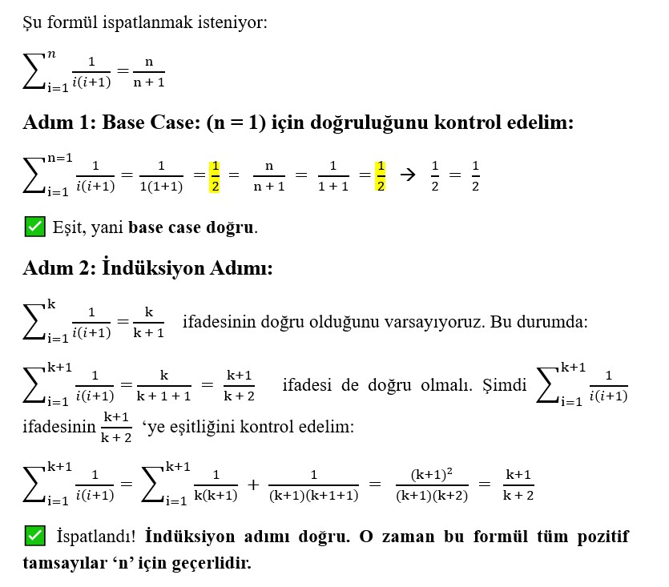
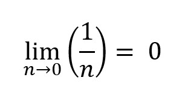
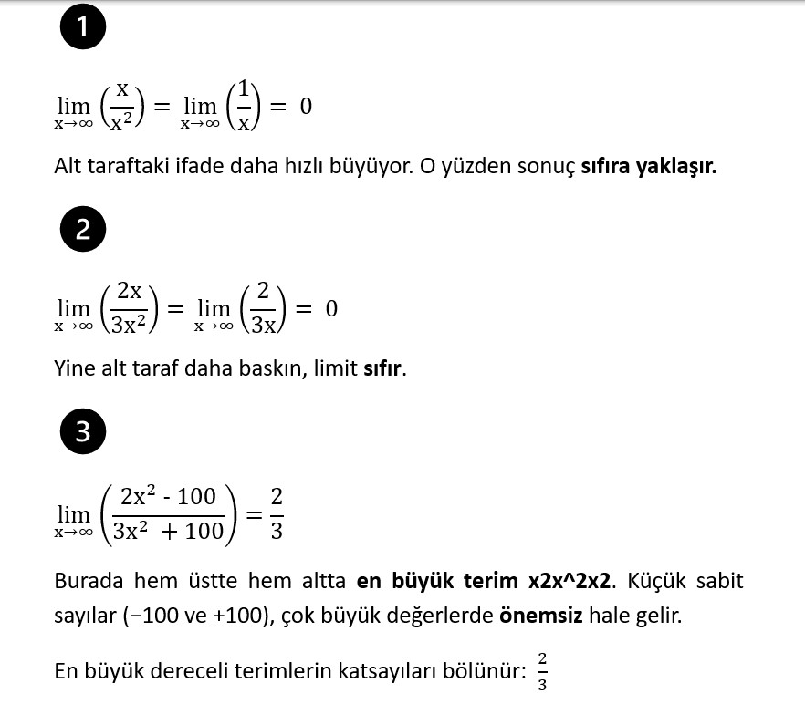
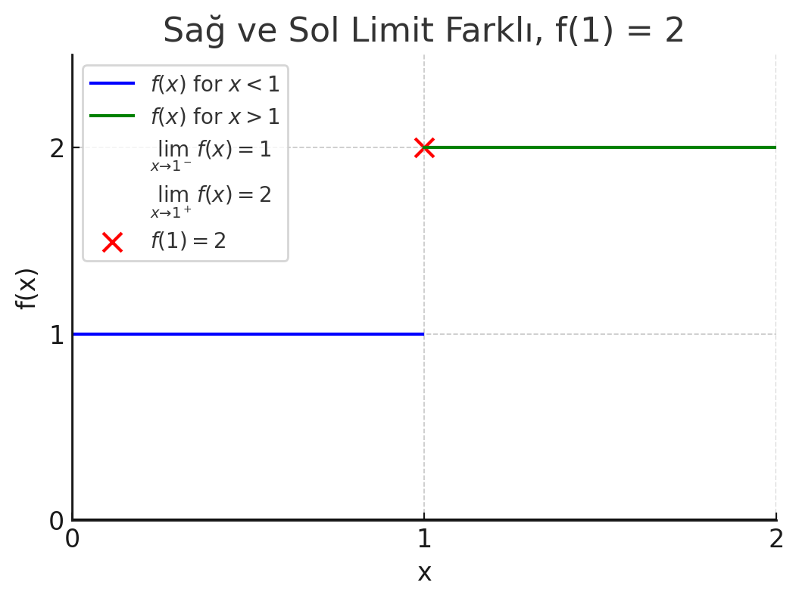

# 🧮 Modül 2: Türev ve Uygulamaları

Bu modülde matematiksel indüksiyon, limitler ve türev kavramlarını öğreneceksiniz. Türevin geometrik ve fiziksel anlamını keşfedeceksiniz.

---

## 🔄 Matematiksel İndüksiyon Nedir?

Matematiksel indüksiyon, sonsuz sayıda durumun geçerli olduğunu göstermek için kullanılan bir ispat yöntemidir. Genellikle n doğal sayılarını içeren formüllerde veya dizilerde kullanılır.

İki Temel Adımı Vardır:

- **Başlangıç Durumu (Base Case)**: İspat etmek istediğimiz formülün en küçük değer (genelde n=0 ya da n=1) için doğru olduğunu gösteririz.
- **İndüksiyon Adımı**: n=k için ifadenin doğru olduğunu varsayarız (indüksiyon varsayımı).
  Sonrasında bu varsayımı kullanarak, n=k+1 için de doğru olduğunu gösteririz.

### Örnek (Tümevarım Yöntemi)

# Sonsuzda Limit (Limits at Infinity)

Teorik olarak bir sayıyı sürekli ikiye bölsek bile tam sıfıra asla ulaşamayız ama çok yaklaşabiliriz. İşte limit burda devreye girer.

Mesela 1/ n ifadesine bakalım. n büyüdükçe (1000, 1.000.000 gibi), bu ifade sıfıra yaklaşır ama asla sıfır olmaz.

Matematiksel olarak :

Çünkü:
n çok büyük seçilirse, sonuç sıfıra istediğimiz kadar yaklaşır. Ama hiçbir zaman sıfır olmaz.
​

# ​Limitte Sonsuza Gidiş

Eğer sonsuza kadar gidebiliyorsam, istediğim kadar küçük bir değere ulaşabilirim. Bu yüzden buna sonsuzda limit deriz.

### Örneklerle Sonsuzda Limit

### **Genel kuralımız şöyledir:**

| Üstteki terim | Alttaki terim | Limit sonucu  |
| ------------- | ------------- | ------------- |
| Daha büyük    | Daha küçük    | Sonsuz (∞)    |
| Daha küçük    | Daha büyük    | 0             |
| Aynı derece   | Aynı derece   | Katsayı oranı |

​

# Belirli Bir Noktada Limit

### Parçalı Fonksiyonlarda Limit

Örneğin bu grafiğimizde **x=1** için fonksiyonun sağdan ve soldan limitlerine baktığımızda farklı değerler olduğu için burda **LİMİT YOKTUR.**
Soldan gelirken değer → 1

Sağdan gelirken değer → 2

Ama fonksiyonun değeri
f(1)=2

Farklı bir noktaya bakalım. Örneğin **x=2** için sağdan ve soldan geldiğimizde aynı değere, 1 değerine ulaşıyoruz. Sağ ve sol limitler eşit olduğundan burada **LİMİT VARDIR.**

### Sonsuza Giden Limitler

x sonsuza gittiğinde **(x -> ∞):**

- sağdan ve soldan baktığımızda limit 0 olur. Burda **LİMİT VARDIR.**

Ama x sıfıra yaklaşırken **(x -> 0):**

- Sağdan baktığımızda limit +∞ 'a gider
- Soldan baktığımızda limit -∞ 'a gider
  Eşit olmadığından burda **LİMİT YOKTUR**

### Limitin mevcut olmaması iki şekilde olabilir:

- Sağ ve sol limitler eşit değilse → limit yoktur.

- Fonksiyon sonsuza gidiyorsa veya tanımsızsa → limit yoktur.

# Fonksiyonlarda Süreklilik

Eğer grafiği çizerken kalemi kaldırmadan çizebiliyorsak o noktada süreklilik vardır

Grafikte bir atlama (jump) varsa → süreksizlik vardır.

Fonksiyonun bir noktada değeri yoksa veya delik (hole) varsa → süreksizlik vardır.

### Süreklilik için Gerekli Koşullar

| Açıklama                                                            |
| ------------------------------------------------------------------- |
| Fonksiyonun o noktadaki değeri var olmalı.                          |
| Grafikte sağdan ve soldan yaklaşınca aynı değere ulaşılıyor olmalı. |
| Limit değeri ile fonksiyonun değeri eşit olmalı.                    |
