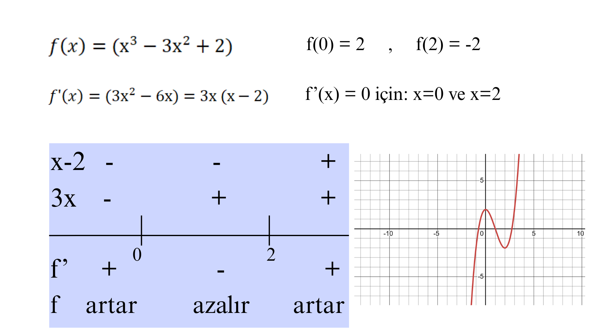
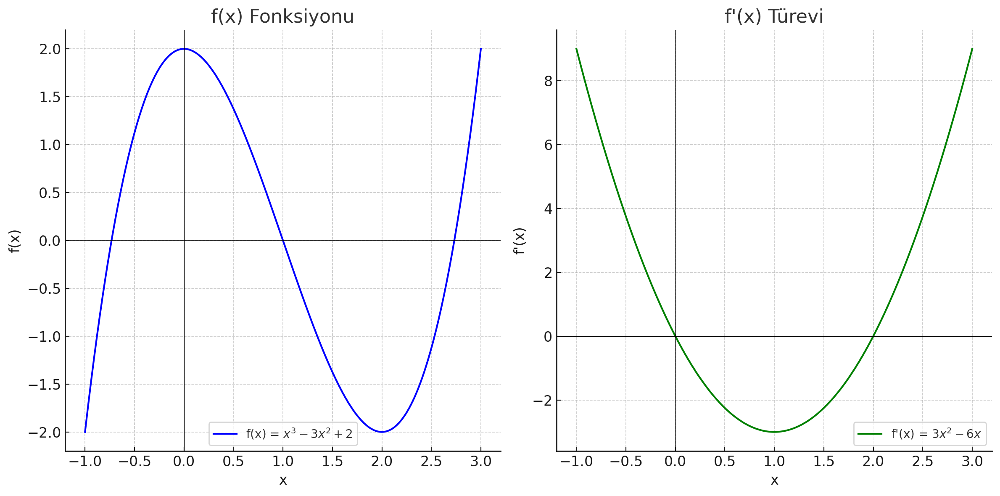
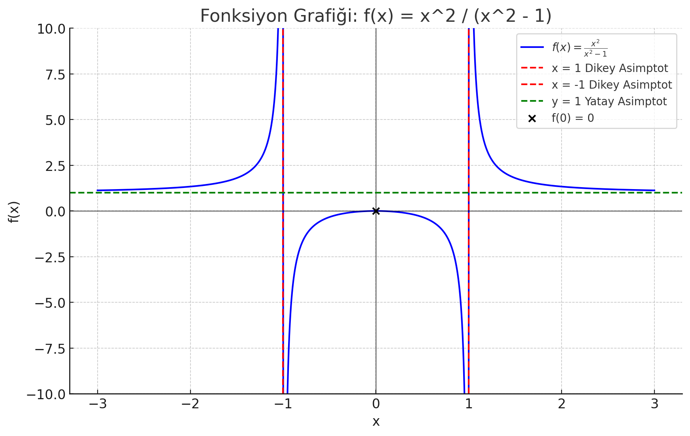

# 🎯 Modül 5: Fonksiyon Analizi ve Grafik Çizimi

Bu modülde türev kullanarak fonksiyon grafiği çizmeyi, fonksiyon davranışlarını analiz etmeyi öğreneceksiniz.

---

## 📊 Türev Kullanarak Fonksiyon Grafiği Çizmek

### Türev Pozitif veya Negatif Olduğunda Ne Olur?

Türev pozitifse: Fonksiyon yukarı doğru gidiyordur (grafik artıyordur).

Türev negatifse: Fonksiyon aşağı doğru gidiyordur (grafik azalıyordur).

Türev sıfırsa: Fonksiyonun eğimi sıfırdır, yani o noktada yatay bir teğet vardır. Bu nokta maksimum veya minimum olabilir.

Fonksiyon:

- x < 0 aralığında artıyor

- 0 < x < 2 aralığında azalıyor

- x > 2 aralığında tekrar artıyor

Bu şekilde, yalnızca türev kullanarak fonksiyonun grafiğini yaklaşık olarak çizebiliriz.

### İkinci Türev ile Eğrilik Bulma

Yukardaki f(x) fonksiyonun 2.türevini alırsak:

f''(x)= 6x - 6 = 6(x - 1)

| x Değeri | f''(x) İşareti | Eğrilik Türü       | Açıklama                    |
| -------- | -------------- | ------------------ | --------------------------- |
| x < 1    | f''(x) < 0     | Konveks: dış bükey | Fonksiyon tümsektir         |
| x = 1    | f''(x) = 0     | Geçiş Noktası      | Eğrilik yönü burada değişir |
| x > 1    | f''(x) > 0     | Konkav: iç bükey   | Fonksiyon çukurdur          |

# Fonksiyon Grafiği ve Fonksiyon Türevinin Grafiği Arasındaki İlişki F(X) - F'(X)

Grafiklerden biri f(x), diğeri f’(x) olduğunda, türevin pozitif olduğu yerlerde f(x) artar, negatif olduğu yerlerde azalır. Eğimin 0 olduğu noktalarda ise tepe veya çukur noktalar oluşur.

| Aralık    | f’(x) Durumu        | f(x) Davranışı   |
| --------- | ------------------- | ---------------- |
| x < 0     | f’(x) > 0 (pozitif) | f artıyor        |
| 0 < x < 2 | f’(x) < 0 (negatif) | f azalıyor       |
| x > 2     | f’(x) > 0 (pozitif) | f tekrar artıyor |

## Karmaşık Fonksiyonun Grafiğini Çizme

### Fonksiyonun Tanım ve İşaret Tablosu

| x Değeri | x < -1 | -1 < x < 0 | 0   | 0 < x < 1 | x > 1 |
| -------- | ------ | ---------- | --- | --------- | ----- |
| x²       | +      | +          | +   | +         | +     |
| x - 1    | -      | -          | -   | -         | +     |
| x + 1    | -      | +          | +   | +         | +     |
| f(x)     | +      | -          | 0   | -         | +     |

Tanımsız Noktalar: x=−1 ve x=1. Bu noktalar dikey asimptot olur.

f(0)=0 olduğu görülmüş. Bu da grafiğin orijinden geçtiğini gösterir.

Hem pay hem paydanın derecesi aynı (2. derece).
Bu durumda yatay asimptot:
payın en yüksek dereceli katsayısı / paydanın en yüksek dereceli katsayısı = 1 / 1= 1

Yani y = 1 yatay asimptotdur.

### Türev ve Artış/Azalış Tablosu

| x Değeri | x < -1    | -1 < x < 0 | 0     | 0 < x < 1  | x > 1      |
| -------- | --------- | ---------- | ----- | ---------- | ---------- |
| -2x      | +         | +          | 0     | -          | -          |
| (x - 1)² | +         | +          | +     | +          | +          |
| (x + 1)² | +         | +          | +     | +          | +          |
| f'(x)    | +         | +          | 0     | -          | -          |
| f(x)     | ↑ artan ↑ | ↑ artan ↑  | durdu | ↓ azalan ↓ | ↓ azalan ↓ |
