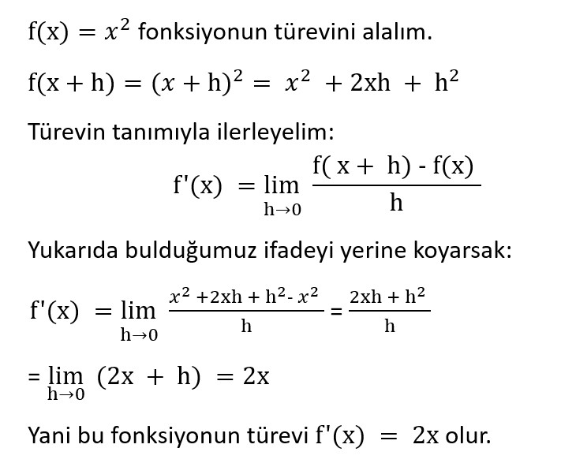

# Türev (Derivative)

Fonksiyonun bir noktadaki türevi, o noktadan geçen teğetin **eğimini** verir.
Bu eğim, iki nokta arasındaki ortalama değişim oranının, bir noktaya (h → 0) limitidir.

Fonksiyonda iki nokta alınır:

x ve x + h

Bu iki nokta arasındaki ortalama değişim oranı:

h → 0 olduğunda bu oran, o noktadaki anlık değişimi yani türevi verir:

# FONKSİYONUN TÜREVİ

Aşağıdaki örneği inceleyelim:

Fonksiyonun grafiğini çizelim:

x=1 için eğim: 2

x=−1 için eğim: -2

x=0 için eğim: 0 (minimum nokta)

Grafiğe baktığımızda, x arttıkça türev (eğim) de artmış, grafik daha dik hale gelmiş.

# Üstel Fonksiyonun Türevi

Bu fonksiyon sıfıra asla ulaşmaz; x azaldıkça y eksenine yaklaşır ama değmez

x=0 için: türev = 1

x=1 için: türev = e

x=−1 için: türev = 1/e

Yani fonksiyonun herhangi bir noktasındaki eğim (türev), o noktadaki y değeriyle aynıdır.

# Sabit Fonksiyonun Türevi

f(x) = 2 fonksiyonunun türevini hesaplayalım.
Öncelikle türev formulünü hatırlayalım:

Burada hem f(x+h) hem de f(x) sabit olarak 2 olduğu için:
(2 - 2)/h = 0/h = 0

Yani limit de 0 olur.

